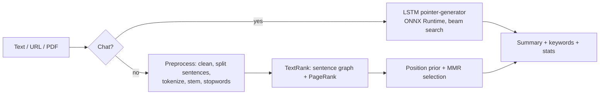

# Text Summarizer

Summarize articles, documents and chats with **classical NLP algorithms implemented from scratch** and an **LSTM pointer-generator network** trained from scratch. No pretrained transformers. It includes a FastAPI backend, a lightweight web UI, and a reproducible ROUGE benchmark suite.


| | |
|---|---|
| **Extractive** | TextRank, LexRank, LSA, TF-IDF centroid (MEAD), Luhn, plus MMR redundancy control and a lead-position prior. PageRank, TF-IDF and SVD scoring are written in NumPy. |
| **Abstractive** | BiLSTM encoder + Bahdanau attention + pointer (copy) mechanism + coverage (See et al., 2017), trained on SAMSum. Beam search with trigram blocking. |
| **Evaluation** | ROUGE-1/2/L/Lsum implemented from scratch (exact match with Google's `rouge-score`), bootstrap confidence intervals, paired significance tests, greedy extractive oracle. |
| **Serving** | FastAPI + ONNX Runtime (int8). The LSTM runs **without PyTorch** in ~230 MB of RAM. |
| **Input** | Paste text, fetch a URL (SSRF-protected), or upload a PDF / TXT / Markdown file. |

---

## Results

ROUGE F1 × 100, measured on the official test sets.

### Chat summarization (SAMSum, 819 test dialogues)

| System | R-1 | R-2 | R-L |
|---|---|---|---|
| Lead-3 baseline | 31.44 | 8.75 | 24.24 |
| Best classical extractive (TF-IDF centroid) | 32.29 | 10.35 | 24.70 |
| **LSTM pointer-generator + coverage (ours)** | **39.89** | **17.01** | **33.33** |

- **+8.45 ROUGE-1** over Lead-3 (paired bootstrap, p < 0.05) and **+7.6** over the best classical method.
- Ablation: the copy mechanism adds **+4.9 ROUGE-1** and coverage adds **+1.05** on top of a seq2seq + attention baseline.

### News summarization (CNN/DailyMail, 1,000 test articles)

| System | R-1 | R-2 | R-L |
|---|---|---|---|
| TextRank | 36.15 | 14.43 | 23.18 |
| **TextRank + position prior + MMR (ours)** | **39.32** | **16.71** | **24.87** |

- **+3.17 ROUGE-1** over standard TextRank, with every algorithm implemented from scratch in NumPy.
- About **4 ms per article** on a single CPU thread.

### Efficient inference

| | PyTorch | **ONNX int8 (ours)** |
|---|---|---|
| Peak memory | 745 MB | **230 MB (3.2× less)** |
| Model size | 32 MB | **9.8 MB** |
| ROUGE-1 change | — | −0.13 |

### Verified evaluation

- ROUGE implemented from scratch, matching Google's `rouge-score` exactly on 1,200 cross-checked scores.
- Our Lead-3 baseline reproduces the published SAMSum result (31.44 vs 31.40 reported by Gliwa et al., 2019).

---

## How it works



- **Preprocessing:** rule-based sentence splitter (handles "Dr.", "U.S.", initials and decimals), Porter stemming or WordNet lemmatization, built-in stopword list. It works without downloading NLTK data.
- **Extractive scoring:** every algorithm only scores sentences. Selection (length, MMR, position prior) is shared, so the methods are compared fairly.
- **Pointer-generator:** at each step the model mixes "generate a word from the vocabulary" with "copy a word from the input" (`p_gen`). Coverage tracks what has already been attended to and penalizes repeated attention. Beam search is written in NumPy over a small backend interface, so PyTorch and ONNX Runtime decode with the same code.
- **Keywords:** TF-IDF terms and RAKE key phrases.

---

## Quickstart

Requires Python 3.10+.

```bash
git clone https://github.com/aldol07/Text-Summarizer.git
cd Text-Summarizer
python -m venv .venv
.venv\Scripts\activate          # Windows
# source .venv/bin/activate     # macOS / Linux
pip install -r requirements.txt
```

### Web app + API

```bash
uvicorn textSummarizer.api.main:app --port 8010
```

Open http://127.0.0.1:8010 for the UI or http://127.0.0.1:8010/docs for the interactive API docs.

The extractive summarizers work out of the box. The chat (LSTM) summarizer needs the trained ONNX model in `artifacts/onnx/pointer_coverage/int8/` (see [Train the LSTM](#train-the-lstm)). Without it, chats fall back to the best extractive method.

### Command line

```bash
python -m textSummarizer.cli examples/sample_article.txt
python -m textSummarizer.cli examples/sample_article.txt -m lexrank -n 2 --mmr
python -m textSummarizer.cli examples/sample_article.txt --compare
python -m textSummarizer.cli --list-methods
```

### API examples

```bash
curl -X POST http://127.0.0.1:8010/api/v1/summarize \
  -H "Content-Type: application/json" \
  -d "{\"text\": \"Sam: Are you coming to dinner on Saturday?\nLucy: Of course! What time?\nSam: 7 pm at the Italian place.\"}"
```

| Endpoint | Purpose |
|---|---|
| `GET /health` | Status, and whether the LSTM is loaded |
| `GET /api/v1/methods` | Available methods |
| `POST /api/v1/summarize` | `text`, optional `method` (default `auto`), `mode` (`auto` / `article` / `dialogue`), `num_sentences` or `ratio`, `use_mmr`, `position_weight`, `reference` (adds ROUGE) |
| `POST /api/v1/compare` | Every method on the same text, with latency and optional ROUGE |
| `POST /api/v1/extract/url` | Main text of a web page |
| `POST /api/v1/extract/file` | Text of a PDF / TXT / Markdown upload (max 5 MB) |

`method=auto` uses the LSTM for chats and TextRank + position prior + MMR for everything else.

### Configuration

| Environment variable | Default |
|---|---|
| `LSTM_MODEL_DIR` | `artifacts/onnx/pointer_coverage/int8` |
| `ENABLE_ABSTRACTIVE` | `true` |
| `ALLOWED_ORIGINS` | `http://localhost:8000,http://127.0.0.1:8000` (comma-separated) |
| `MAX_TEXT_CHARS` | `50000` |
| `MAX_UPLOAD_MB` | `5` |
| `SERVE_FRONTEND` | `true` |
| `ONNX_THREADS` | `1` |

The frontend (`frontend/`) is plain HTML/CSS/JS with no build step.

---

## Reproduce the results

```bash
pip install -r requirements-dev.txt
python scripts/download_nltk.py          # optional: Punkt + WordNet
```

### Benchmarks

Datasets are downloaded from the Hugging Face Hub on first use (CNN/DailyMail 3.0.0 test split, SAMSum).

```bash
python scripts/benchmark.py --dataset cnn_dailymail --limit 1000
python scripts/benchmark.py --dataset cnn_dailymail --suite ablations
python scripts/benchmark.py --dataset samsum
python scripts/benchmark.py --dataset samsum --suite abstractive     # after training + export
python scripts/benchmark.py --dataset my_docs.jsonl                  # your own {"id","text","summary"} lines
```

Experiments are defined in [`config/benchmark.yaml`](config/benchmark.yaml). Each run writes a Markdown table, CSV/JSON and a chart.

### Train the LSTM

A GPU helps but isn't required. On an RTX 5060 laptop GPU the full model trains in ~32 minutes.

```bash
python scripts/train_lstm.py --variant pointer_coverage     # full model
python scripts/train_lstm.py --variant pointer              # ablation
python scripts/train_lstm.py --variant seq2seq_attention    # ablation
python scripts/export_onnx.py                               # ONNX fp32 + int8, parity + memory report
```

The pipeline runs five stages (ingest → validate → transform → train → evaluate). Hyperparameters are in [`config/lstm.yaml`](config/lstm.yaml). Models are written to `artifacts/` and are not committed.

---

## Project structure

```
src/textSummarizer/
├── preprocessing/   cleaning, sentence segmentation, tokenization, stemming/lemmatization
├── extractive/      TextRank, LexRank, LSA, TF-IDF, Luhn, baselines, MMR, PageRank, TF-IDF vectorizer
├── abstractive/     vocabulary, pointer-generator model, trainer, beam search, PyTorch/ONNX backends, export
├── evaluation/      ROUGE, oracle, bootstrap/significance tests, datasets, benchmark runner, reports
├── features/        keywords (TF-IDF, RAKE), readability stats, dialogue detection
├── api/             FastAPI app, request schemas, URL/PDF ingestion, settings
├── service.py       one-call summarize/compare used by the CLI and the API
└── cli.py
frontend/            web UI (no build step)
scripts/             benchmark, train, export, NLTK download
config/              benchmark and LSTM configuration
```

---

## Limitations

- The LSTM is a small model (8M parameters) trained on 14.7k chats. Its summaries are fluent for everyday conversations but can mix up who did what. It is not reliable on long or non-chat text, which is why `auto` uses it only for chats.
- Extractive summaries reuse the original sentences, so they are faithful to the source but can be less concise.
- URL extraction is heuristic (no JavaScript rendering). Scanned PDFs need OCR, which isn't supported.

## References

- Mihalcea & Tarau (2004). *TextRank: Bringing Order into Texts.*
- Erkan & Radev (2004). *LexRank: Graph-based Lexical Centrality as Salience in Text Summarization.*
- Steinberger & Ježek (2004). *Using Latent Semantic Analysis in Text Summarization.*
- Radev et al. (2004). *Centroid-based summarization of multiple documents* (MEAD).
- Luhn (1958). *The Automatic Creation of Literature Abstracts.*
- Carbonell & Goldstein (1998). *The Use of MMR, Diversity-Based Reranking.*
- See, Liu & Manning (2017). *Get To The Point: Summarization with Pointer-Generator Networks.*
- Gliwa et al. (2019). *SAMSum Corpus: A Human-annotated Dialogue Dataset for Abstractive Summarization.*
- Lin (2004). *ROUGE: A Package for Automatic Evaluation of Summaries.*

## License

MIT. See [LICENSE](LICENSE).
